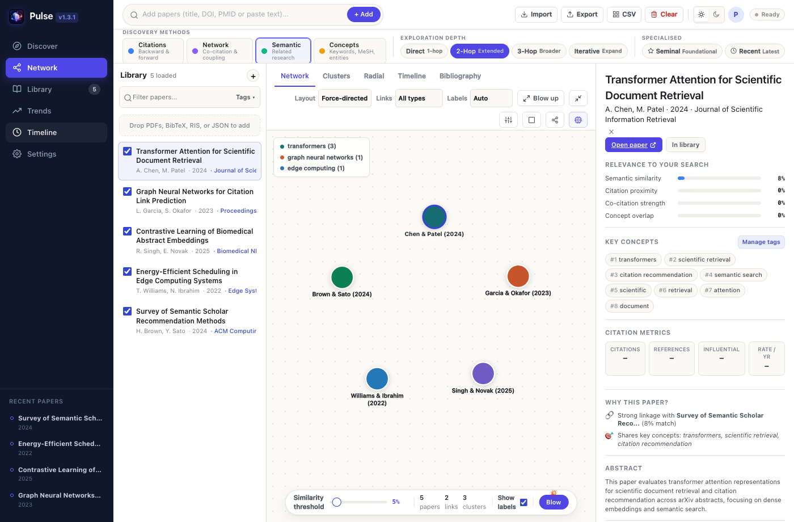
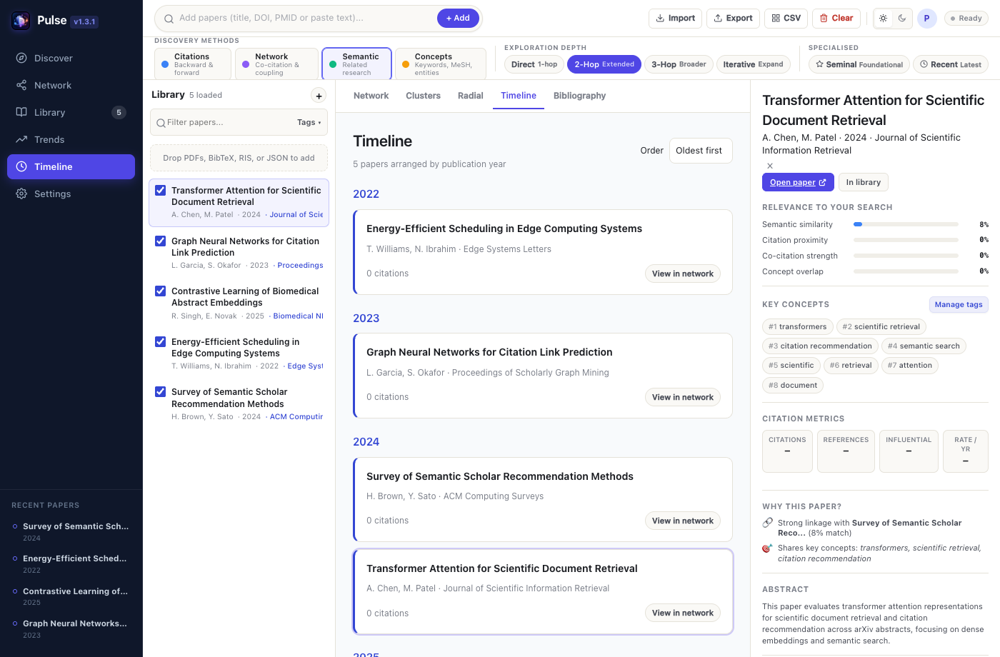
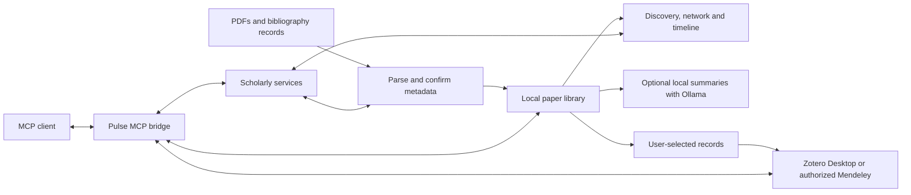

# Pulse

## A connected workspace for scientific literature discovery

**Capability white paper · 8 October 2026**

Pulse brings paper discovery, bibliography management, visual exploration, and optional local AI summaries into one Mac workspace. A researcher can begin with a DOI, a paper title, or an imported PDF; identify the paper; explore related publications; and build a reading collection that can be examined as a network, a timeline, or a bibliography.

This document describes capabilities through the **locally verified 1.5.2 development build**. The current published GitHub installer is **1.3.1**. The repository's `local-web` workspace contains an earlier subset of the newer features. See [Availability and getting started](#9-availability-and-getting-started) for the distinction.

**[Published Mac download](https://github.com/7drbw7mdgf-lgtm/Pulse/releases/download/v1.3.1/Pulse-Tauri-1.3.1.dmg)** · [Releases](https://github.com/7drbw7mdgf-lgtm/Pulse/releases) · [Installation guide](docs/MACOS-INSTALL.md) · [Issues](https://github.com/7drbw7mdgf-lgtm/Pulse/issues)

## Abstract

Literature exploration involves several connected tasks: identifying a publication, finding its intellectual neighbors, comparing sources, deciding what to read, and preserving a useful bibliography. Pulse connects these tasks around a shared local paper library. It combines citation-based exploration with recommendation and concept-search branches, supports multiple visual views of the same collection, and offers local summaries through Ollama.

The 1.5.2 development build adds provider-attributed citation metrics, pageable citation and reference lists, and connections to Zotero and Mendeley through both the interface and a Model Context Protocol (MCP) bridge. Its central principle is to preserve the distinction between a publication's identity, an index's reported evidence, a calculated relationship, and an AI-generated interpretation. Researchers remain responsible for selecting papers and checking their contents. Pulse supports exploratory research and review preparation; it does not establish the completeness of a systematic search or the validity of a scientific claim.

## 1. The research workflow

Pulse organizes literature work around a repeating sequence:

1. **Identify.** Import a paper or bibliography and resolve its bibliographic identity.
2. **Explore.** Follow references, incoming citations, shared citation neighborhoods, and topic-based recommendations.
3. **Inspect.** Examine metadata, source-linked metrics, abstracts, and relationships before accepting a candidate.
4. **Organize.** Select papers, adjust the map, filter the library, and use tags and chronological views to plan further reading.
5. **Synthesize and transfer.** Generate optional local summaries, export records, or send chosen papers to a reference manager.

The collection connects these activities. A paper selected in the library or on the map becomes the context for inspection and further discovery. Researchers can expand from several seed papers and review candidates before adding them, keeping the collection focused on their question.

## 2. Capabilities at a glance

The table describes the 1.5.2 development build; release availability is listed in Section 9.

| Capability | What Pulse supports | Research value |
| --- | --- | --- |
| Paper ingestion | PDF and bibliography imports, pasted identifiers or text, and direct file drops onto the map | Start from existing reading material |
| Metadata resolution | DOI-first lookup, followed by matching against available bibliographic metadata | Reduce manual entry and mistaken identities |
| Literature discovery | References, incoming citations, citation neighborhoods, provider recommendations, and concept search | Explore several routes beyond a seed paper |
| Visual exploration | Network, cluster and radial layouts, a chronological Timeline, and bibliography views | Examine relationships and publication order |
| Library management | Search, filters, tags, sorting, full-screen library, and compact or expanded records | Keep a growing collection navigable |
| Citation evidence | Source-linked counts, time checked, and separate list-coverage reporting | Assess what an index actually reports |
| Paper summaries | Optional background scans using installed local Ollama chat models | Prepare an initial reading overview |
| Reference-manager connections | Explicit metadata sends to Zotero Desktop and an authorized Mendeley account | Carry selected discoveries into a writing workflow |
| MCP tools | Library search, metrics, citation/reference pages, connection status, and selected-record saves | Make bibliographic operations available to a compatible assistant |

*Published 1.3.1 interface with an illustrative sample library. This image demonstrates the workspace layout; it does not show every 1.5.2 addition.*

## 3. From imported files to identifiable papers

Pulse accepts paper identifiers and several bibliography formats, including BibTeX, RIS, CSV, JSON and supported EndNote records. PDFs can provide extractable text, embedded metadata, and links that help identify the publication. In the newer workspace, files can be dropped directly onto the map, keeping import close to exploration.

The parsing workflow extracts and normalizes DOI candidates from the available record. A DOI lookup is attempted first. When the paper cannot be identified that way, the resolver searches using the available title, authors, year, journal and other bibliographic fields. Matching considers the candidate's agreement with the imported record; weak or ambiguous results preserve the extracted record rather than replacing it with an uncertain identity.

This is useful when a filename is uninformative, a citation is pasted as prose, or a bibliography uses wrapped fields and multiple author entries. Identification quality still depends on the input. The current summary/import workflow does not provide OCR for image-only PDFs or retrieve paywalled article text. A readable PDF, an abstract, or a structured bibliography gives the app more evidence to work with.

## 4. Discovery through several kinds of evidence

Pulse's discovery workflow combines branches that answer different questions. Direct references reveal the work a seed paper cites. Incoming citations find publications that cite the seed. Additional traversal expands this neighborhood across further hops, within configured limits.

Citation-network methods offer another perspective. **Co-citation** links papers cited together by other works. **Bibliographic coupling** connects papers that share references. Provider recommendations and concept searches can bring in relevant publications outside an immediate citation path. Keywords, exclusions, exploration depth, and recency or impact preferences help steer the candidates.

Candidates are merged, deduplicated and ranked for review. Ranking uses signals such as title overlap, author or journal overlap, steering terms, and agreement across discovery branches. These scores help order candidates; they are not calibrated probabilities of relevance or measures of scientific quality. Recommendation labels also do not imply that a specific embedding model has been run locally. Local text-based relationships depend on the configured model or available fallback.

The graph supports navigation and comparison. Some connections reflect bibliographic evidence; others reflect calculated text or concept similarity. A visible link should be interpreted according to its evidence and type. It does not, by itself, establish that two studies reach the same conclusion or that one validates the other.

## 5. One collection, complementary views

The Network workspace places papers, relationships, the library, and the inspector within the same working area. Force, cluster and radial arrangements provide different ways to examine the collection. Link filters, labels and thresholds let users adjust what is visible.

Timeline arranges papers chronologically, helping researchers move from earlier work to newer developments. Bibliography and library views emphasize titles, authors, years and journals. Search, tags and sorting help narrow the collection. Full-screen library mode and compact/expanded density controls in the newer workspace support focused reading-list management. The inspector can be hidden to give the map more space.

*Timeline in the published 1.3.1 interface, using demonstration records.*

Together, these views support concrete tasks: tracing a field's development, comparing a small group of related studies, organizing papers for a seminar, or assembling a bibliography around a research question.

## 6. Citation metrics with provenance and coverage

The 1.5.2 development build retrieves metrics only after confirming a paper match. A DOI must agree exactly; title-based resolution considers other available metadata and rejects ambiguous candidates. Metrics record the provider, its identifier, a source link, and the time checked. Semantic Scholar is used when a confirmed record is available, with OpenAlex as an alternative. A selected source remains attached to its counts and lists.

The inspector displays citation and reference counts and, where supplied, influential-citation counts. Actual zeros remain **0**; unavailable values appear as **—**. Influential counts are not estimated from citation totals. **Average per year** is a calculation: citations divided by the calendar years since publication, including the current year. It is not an annual citation-history measurement.

**Citing papers** and **References** open searchable lists. Users can load another page of up to 100 records or continue through all available pages, stop loading, add individual records to Pulse, and export the loaded list as RIS, CSV or JSON. A partial list remains identified as partial.

Coverage is reported separately from headline metrics. A provider's paper counter can differ from the count returned by its searchable list index. Some indexed references may be unresolved, and some lists may be withheld. Pulse exposes these differences instead of inventing missing records. “All available pages loaded” describes the response of the chosen index, not a claim that every published citation has been recovered.

## 7. Optional local AI and connected bibliographies

### Local paper summaries

The floating AI agent in the newer workspace uses installed local Ollama chat models. Researchers choose a model and can request a focus for the scan. Long inputs are read in chunks and their notes are combined into a summary. Background progress, cancellation and summary downloads support a manageable reading workflow; completed results are retained when a scan is stopped.

Results identify whether the source was extracted paper text, an abstract, or metadata only. A bibliography entry alone is not treated as evidence of a study's methods or findings. The summarizer is instructed to stay within the supplied source and distinguish reported findings from inference. Generated summaries still require comparison with the article, especially for numerical results, limitations and interpretation. No independent summary-accuracy benchmark is claimed.

Ollama and its model weights are installed separately. The dedicated summary agent uses local inference. Broader AI settings also support optional cloud analysis; data handling therefore depends on the feature and provider selected. Basic bibliography management and graph exploration do not require an AI model.

### Zotero and Mendeley

The 1.5.2 development build adds a compact connection box at the top of the page. It lets users choose a selected paper, selected discovery results, the loaded citation/reference list, or the entire Pulse library for transfer.

Zotero uses the Desktop application on the same Mac and imports into its currently selected editable library or collection. Mendeley uses a user-configured registered application: client ID, client secret, and matching redirect URL, followed by account authorization. Connection status is checked before the interface enables sending.

Transfers contain bibliographic metadata and abstracts. These connector operations do not upload PDFs or full paper text. Pulse tracks its own successful sends and retains successful receipts if a later record fails. This reduces repeat sends through Pulse, while duplicates created outside Pulse still require reference-manager review.

### MCP access

The Pulse bridge exposes six bibliographic tools to a compatible MCP client:

| Tool | Operation |
| --- | --- |
| `pulse_papers` | List or search the saved Pulse library |
| `paper_metrics` | Retrieve confirmed, provider-attributed metrics |
| `paper_citations_references` | Retrieve a citation/reference page and its continuation |
| `library_manager_status` | Check Zotero and Mendeley connections |
| `library_manager_search` | Search a connected manager library |
| `library_manager_save` | Save explicitly chosen records to a selected destination |

The save tool changes the destination library and is intended for explicit user requests. Account setup remains in Pulse; credentials are not returned by the tools. The bibliographic tools omit full PDF text. Zotero library search requires its local API to be enabled. MCP clients receive the records they request, and their own settings govern subsequent handling of that data.

## 8. Architecture, data flow and verification

Pulse uses a Tauri desktop shell, a browser-based workspace, and a Python backend served on localhost. Library and settings data are held on the Mac. Scholarly metadata and discovery use online services, including Semantic Scholar, OpenAlex, Crossref and PubMed. Optional AI and connector operations have their own destinations.

*Conceptual flow for the 1.5.2 development build. Online requests are part of metadata lookup and discovery; local storage does not imply that every operation is offline.*

| Operation | Data destination |
| --- | --- |
| Library management and map exploration | Local Pulse storage and workspace |
| Metadata matching and literature discovery | The scholarly services used for that operation |
| Dedicated Ollama summary scans | A local Ollama model on the Mac |
| Optional cloud AI analysis | The configured cloud provider |
| Zotero/Mendeley sends | The chosen reference manager, with metadata and abstracts |
| MCP reads | The requesting MCP client |

Session authentication, loopback request checks, protected local credential storage, bounded extraction, background jobs and caches support the local service architecture. They do not constitute an independent security certification. Network availability, provider limits, input quality, model resources, and collection size affect results and responsiveness.

The locally built 1.5.2 package passed **42 Python tests**, JavaScript parser/library checks, and MCP initialization and tool-discovery smoke checks. Live checks verified public-paper identity and counts, retrieved available references, and traversed successive citation pages. The exact packaged backend and PDF dependency were checked; the app's deep signature and disk-image integrity were verified.

These checks used isolated data. Connector writes were tested with mocks; live Zotero/Mendeley account exports await account setup and authorization. The checks do not establish discovery recall, summary accuracy, or performance for every library. [Performance notes](docs/PERFORMANCE.md) contain release-specific observations for 1.3.1; those measurements should not be transferred to a different build.

## 9. Availability and getting started

| Distribution | Availability | Scope |
| --- | --- | --- |
| **1.3.1 Mac release** | [Published DMG](https://github.com/7drbw7mdgf-lgtm/Pulse/releases/tag/v1.3.1) | Shared library, discovery, network, Timeline and bibliography workspace |
| **Repository `local-web` workspace** | [Source and setup guide](local-web/README.md) | Earlier local-web updates, including DOI-first parsing, Ollama summaries and expanded library controls |
| **1.5.2 development build** | Built and verified locally; installer and MCP package are not yet GitHub release assets | Updated desktop drops, sourced metrics, pageable citation/reference lists, and Zotero/Mendeley/MCP connections described above |

For the published app, download the DMG, copy Pulse into **Applications**, launch it, and add a seed paper. Inspect its record, choose discovery options, review candidates, and explore the resulting collection in Network or Timeline. The [installation guide](docs/MACOS-INSTALL.md) documents the public release.

The published 1.3.1 Mac build targets Apple Silicon and macOS 11 or later, with Python 3.9 or later available to the launcher. The locally verified 1.5.2 build requires Python 3.10 or later at `/opt/homebrew/bin/python3` or `/usr/local/bin/python3`. PDF extraction dependencies are included in that package; a Python interpreter, Ollama and model weights are installed separately. These builds are ad hoc signed and are not Apple-notarized.

For a separately runnable source workspace, follow the [local-web instructions](local-web/README.md). Its isolated data-directory option allows experimentation with a separate library. Export a copy of valuable work before clearing a collection.

## 10. Scope and ongoing development

Pulse is useful for exploratory literature reviews, topic familiarization, teaching, reading-group preparation and citation-led discovery. The researcher selects the question, judges relevance, reads the evidence, and decides which papers to preserve or transfer.

Current practical limits include incomplete scholarly indexes, provider restrictions, ambiguous metadata, PDFs without readable text, model-dependent summary quality, and account-dependent integrations. A rigorous review still needs a documented search strategy and independent screening. Cross-platform installers, Apple notarization, OCR and quantitative evaluations of discovery and summarization remain outside the capabilities established here.

For development setup, packaging, implementation provenance and tests of the published workspace, see [Development notes](docs/DEVELOPMENT.md). Report reproducible issues with the app version, the operation attempted and the observed result in [GitHub Issues](https://github.com/7drbw7mdgf-lgtm/Pulse/issues).
