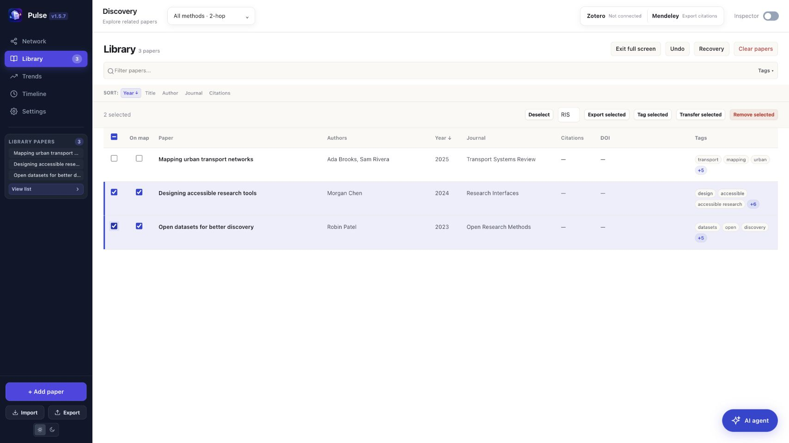
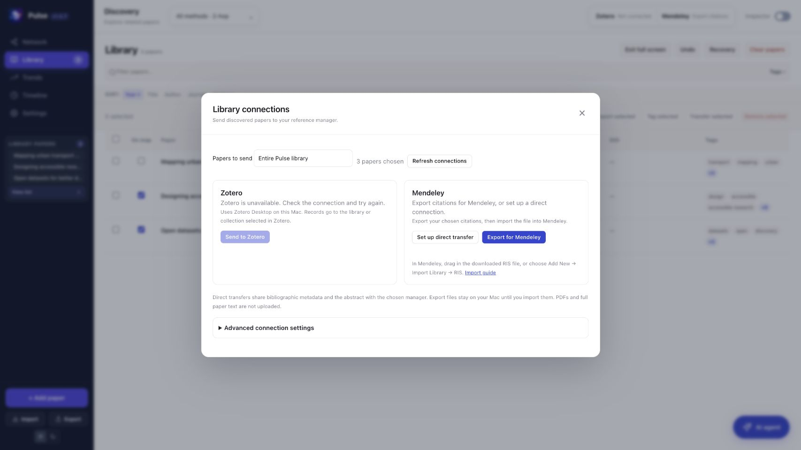

# Pulse

## A connected workspace for scientific literature discovery

**Capability white paper · Pulse 1.5.7 · 8 October 2026**

Pulse brings paper discovery, bibliography management, visual exploration and optional local AI reports into one Mac workspace. Begin with a DOI, a title, an imported PDF or a bibliography; confirm the paper's identity; explore related publications; and keep a collection that can be examined as a network, timeline or full-screen table.

**[Download Pulse 1.5.7 for Mac](https://github.com/7drbw7mdgf-lgtm/Pulse/releases/download/v1.5.7/Pulse-1.5.7.dmg)** · [Installation guide](docs/MACOS-INSTALL.md) · [Release notes](docs/releases/1.5.7.md) · [Issues](https://github.com/7drbw7mdgf-lgtm/Pulse/issues)

*Current screenshots use an isolated library of synthetic demonstration papers. They do not contain a user's reading list or imply verified citation counts for these examples.*

## Abstract

Literature exploration connects several tasks: identifying a publication, tracing its neighbors, comparing evidence, deciding what to read and preserving a useful bibliography. Pulse connects these tasks around a shared local library. Citation-led discovery, concept search, several visual views, reference-manager integration and selected-paper AI reports support a repeating identify–explore–inspect–organize workflow.

The interface distinguishes a publication's identity, an index's reported evidence, a calculated relationship and an AI-generated interpretation. Researchers select the papers and check their contents. Pulse supports exploratory reviews and reading-list preparation; it does not establish the completeness of a systematic search or the validity of a scientific claim.

## 1. Capabilities at a glance

| Capability | What Pulse supports |
| --- | --- |
| Paper ingestion | PDF and bibliography imports, pasted identifiers or text, and file drops directly onto the graph |
| Metadata resolution | DOI-first lookup, followed by matching against available bibliographic metadata |
| Discovery | References, incoming citations, citation neighborhoods, recommendations and concept searches |
| Exploration | Network, cluster and radial arrangements, Timeline and bibliography views |
| Library management | Compact sidebar cards, a full-screen table, search, filters, tags and sorting |
| Bulk actions | Row selection to export, tag, transfer or remove several papers together |
| Recovery | Undo and saved recovery points for removals and cleared workspaces |
| Citation evidence | Provider-linked counts, check time, pageable citation/reference lists and coverage reporting |
| Local AI | A focused report for the selected paper, with cancellation and downloads |
| Reference managers | Zotero Desktop transfer; Mendeley RIS export and configurable direct account connection |
| MCP | Bibliographic library reads, metrics, citation/reference pages and explicitly chosen manager saves |

## 2. From imported files to identifiable papers

Pulse accepts DOI and PubMed identifiers, titles, pasted citations, PDF files and common bibliography formats, including BibTeX, RIS, CSV, JSON and supported EndNote records. PDFs can supply extractable text, document metadata and links. Drop supported paper files directly onto the network grid or use the sidebar's Add paper and Import controls.

The resolver extracts and normalizes DOI candidates, then attempts DOI lookup first. When that cannot identify the paper, it searches the available title, authors, year, journal and other bibliographic fields. Candidate agreement is checked; weak or ambiguous matches preserve the imported record. Source errors also preserve available metadata.

Readable source material matters. Image-only PDFs need OCR or manually supplied metadata; Pulse does not provide OCR or retrieve paywalled article text.

## 3. Discovery and citation evidence

Direct references reveal the work a seed paper cites. Incoming citations reveal work that cites it. Additional hops expand this neighborhood within configured limits. Co-citation connects papers cited together; bibliographic coupling connects papers that share references. Recommendations and concept searches can bring in publications outside an immediate citation path. Discovery options include steering terms, exclusions, depth and recency or impact preferences.

Candidates are merged, deduplicated and ranked for review. Relationship scores help navigation; they are not calibrated relevance probabilities or measures of scientific quality. A visible graph link does not establish that studies reach the same conclusion.

Citation metrics are retrieved only after a confirmed paper match. Counts retain their provider, source link and check time. Semantic Scholar and OpenAlex coverage can differ. Actual zero values remain **0**; missing counts appear as **—**. Influential counts are not estimated from totals. Average per year is a calculation from citation count and publication year, rather than a measured annual history.

**Citing papers** and **References** open filterable lists. Load more pages, stop loading, add records to Pulse or export the loaded results. List coverage is reported separately from the provider's headline count; all available pages describes that index's response, not every citation in existence.

## 4. A library that stays manageable

The sidebar keeps titles and author/year lines compact, with full metadata available on hover and in the inspector. Clicking a paper selects its details. Clicking empty graph space hides the inspector and gives the network more room; selecting a paper node reopens it. The Inspector toggle remains available.

The full-screen library is a table. Row-selection checkboxes are independent of map visibility. Export, tag, transfer and remove operate on the selected rows; selection hidden by filters is counted. The header selection control selects visible rows.

Use **Undo** for the latest change or **Recovery** for saved removal and workspace recovery points. Recovery survives restarting Pulse. Removed papers merge into the current library. Restoring a cleared workspace recovers papers, tags, areas and map settings, while saving the current workspace first. Recovery is local to the Mac; JSON export makes a portable copy.

## 5. Selected-paper reports and reference managers

The floating **AI agent** button opens a reading assistant for the selected paper. It scans available extracted text or an abstract using local Ollama, with an optional focus, progress, cancellation and a downloadable report. Changing the selected paper changes the report context and cancels a running report for the previous paper. The main panel keeps model and service configuration out of the reading workflow.

Reports identify their source, including metadata-only records. A bibliography entry is not treated as evidence of methods or findings. Generated interpretations require checking against the article. Ollama and model weights are installed separately; basic library management works without AI.

The connection box at the top provides Zotero and Mendeley actions. Zotero sends chosen metadata and abstracts to the currently selected editable library or collection in Zotero Desktop. Mendeley offers **Export for Mendeley** without developer registration: download a RIS file for the chosen scope, then import it in Mendeley.

**Direct Mendeley account transfer still requires a registered application.** Set up direct transfer opens its configuration. The shared application has not been activated, and provider PKCE enforcement has not been verified. Pulse uses authorization-code sign-in with an S256 challenge/verifier; the old implicit flow is disabled and no application secret is shipped. See the [activation review](docs/MENDELEY-ACTIVATION.md) for the remaining requirements. This release does not claim a live Mendeley account-transfer test.

Direct manager transfers contain bibliographic metadata and abstracts. These operations do not upload PDFs or full paper text. Exported files remain local until the user imports them.

The included stdio MCP bridge exposes `pulse_papers`, `paper_metrics`, `paper_citations_references`, `library_manager_status`, `library_manager_search` and `library_manager_save`. Save operations require explicit intent and a configured destination. Tools omit full PDF text and never return credentials. Account setup remains in Pulse; the requesting MCP client's settings govern its handling of returned records.

## 6. Architecture and data flow

The current Mac app uses a Tauri shell, the `local-web/pulse-frontend` workspace and a Python backend served on localhost. Libraries, settings and recovery points are stored on the Mac. Scholarly matching and discovery contact online services including Semantic Scholar, OpenAlex, Crossref and PubMed. Local Ollama reports, optional cloud analysis and manager transfers have separate destinations.

| Operation | Data destination |
| --- | --- |
| Library, map and recovery | Local Pulse storage |
| Metadata lookup and discovery | Scholarly services used for that operation |
| Dedicated Ollama report | Local Ollama on the Mac |
| Optional cloud analysis | Configured cloud provider |
| Direct reference-manager send | Chosen manager; metadata and abstract |
| MCP reads | Requesting MCP client |

Session authentication, loopback checks, protected credential storage, bounded extraction and background jobs support the local architecture. They are not an independent security certification. Index coverage, service limits, input quality, model resources and collection size affect results.

## 7. Availability, checks and getting started

The **1.5.7 Mac release** includes the current workspace described above. It targets Apple Silicon Macs on macOS 11 or later and requires Python 3.10 or later. PDF extraction dependencies are included; a Python interpreter, Ollama and model weights are installed separately. The app is ad hoc signed and has not been notarized by Apple.

Download the DMG, drag Pulse into Applications and launch it. Add a seed paper, inspect its record, open Discovery options and review related candidates before adding them. The [installation guide](docs/MACOS-INSTALL.md) documents setup; the [source guide](local-web/README.md) supports a separate local test library.

For this release, **62 Python checks and six JavaScript suites passed**, alongside syntax checks and isolated browser verification. Tests cover parsing, metadata matching, selected-paper reports, selection, bulk scope, save ordering, recovery, manager UI and OAuth guards using synthetic fixtures and mocked services. Packaging verifies resource contents, version, app signature and disk-image integrity. Live account transfers remain dependent on account setup and authorization. These checks do not establish search recall, summary accuracy or performance for every library.

See [development notes](docs/DEVELOPMENT.md) for source layout, checks, MCP and reproducible packaging. Historical root workspace files and tests remain for compatibility; the current desktop build stages the `local-web` source. Apple notarization, cross-platform installers, OCR and quantitative discovery/summary evaluation remain outside the capabilities established here.
