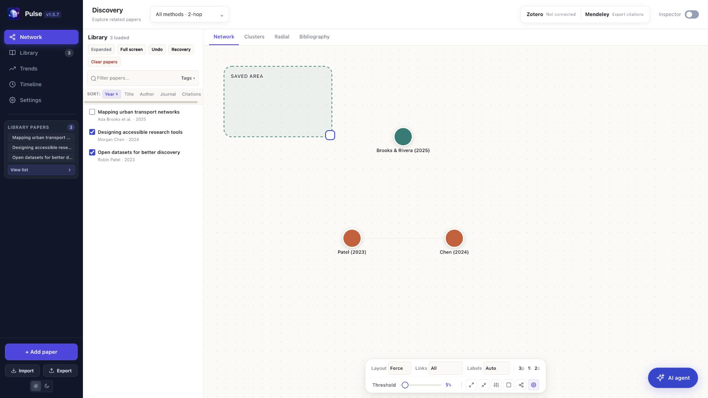

# Pulse 1.5.7 local workspace

This is the source used by the current Mac app. It includes direct graph file drops, DOI-first lookup, sourced metrics and citation/reference lists, a compact discovery menu and library sidebar, a full-screen library table with bulk actions, local undo/recovery and a selected-paper AI assistant.



## Run

Requires Python 3.10 or later. From this directory:

```sh
python3 -m venv .venv
source .venv/bin/activate
python3 -m pip install -r requirements.txt
PULSE_CONFIG_DIR="$PWD/.pulse-data" PULSE_PORT=62661 python3 pulse-backend/pulse_backend.py
```

Open the localhost URL printed by the server. The isolated `.pulse-data` directory keeps this copy separate from an existing library. Omitting `PULSE_CONFIG_DIR` uses the application's normal local storage. Serve the frontend through this backend; opening HTML directly does not start the services.

## Library and graph

Drop PDFs, bibliography files or text directly onto the map. Metadata lookup tries DOI first, then available bibliographic fields; ambiguous matches preserve extracted metadata. Paper nodes reopen the inspector; empty graph clicks hide it. Full screen opens the library table. Select rows to export, tag, transfer or remove them. Map visibility checkboxes are independent.

Undo and Recovery restore removals or a cleared workspace and survive restart. Recovery is local; JSON export creates a portable copy. Clear papers requires confirmation.

## Reports and reference managers

Install and start Ollama separately for optional local reports. Select a paper, then open AI agent. Reports use only that paper's available text, abstract or metadata. Progress, cancellation and downloads are available; model settings are separate from the main report panel. There is no OCR or paywall retrieval.

The top connection box offers Zotero Desktop transfer and Mendeley RIS export. Direct Mendeley sign-in needs registered application settings; shared activation and provider verification remain unfinished. See the [activation review](../docs/MENDELEY-ACTIVATION.md). Scholarly lookup/discovery uses online services; local Ollama reports use local inference.

## Checks

From the repository root, after installing the requirements above and with Node.js available:

```sh
npm run test:workspace
```

This runs 62 Python checks and six JavaScript suites using synthetic data and mocked services. Current desktop packaging stages this directory; see [development notes](../docs/DEVELOPMENT.md).
