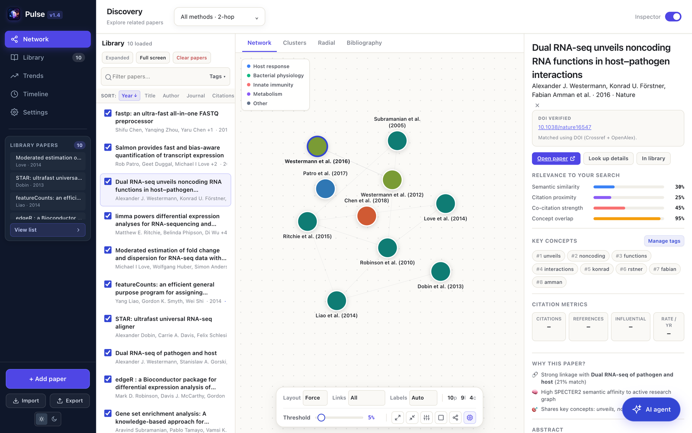
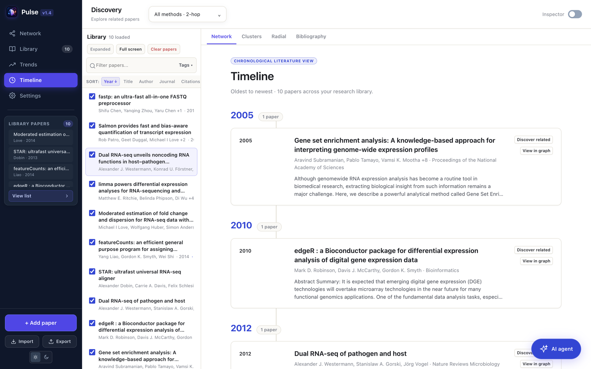
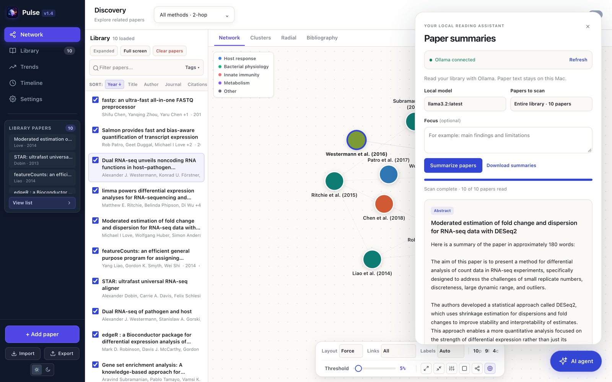
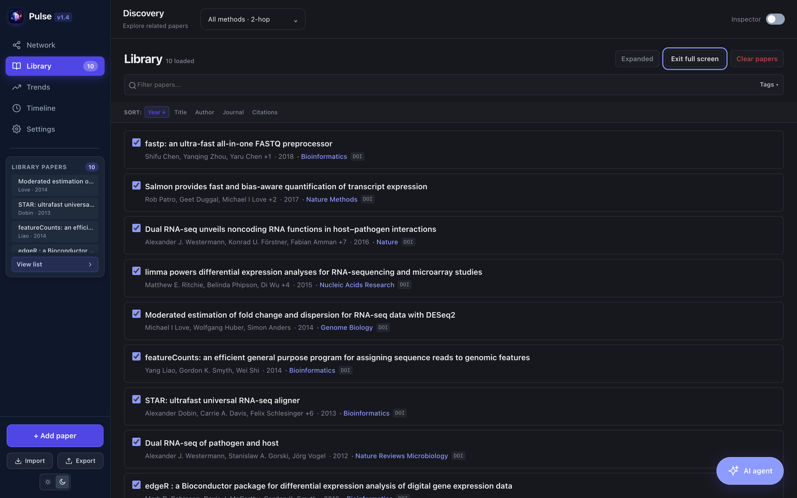

# Pulse local web workspace

Pulse maps the scientific literature around your work. Add papers by DOI, PMID, title or PDF, and Pulse looks up their details, links related papers into a network, and lays them out on a timeline. A local AI agent can summarize your library without sending paper text off your Mac.

This folder runs Pulse in your browser from a small local server. It includes the latest localhost updates: a compact discovery dropdown, map file drops, inspector visibility, sidebar paper actions, a full-screen library with compact and expanded views, and a confirmed **Clear papers** action.



*Screenshots use a demo library of public RNA-seq and dual RNA-seq papers.*

## What you can do

- **Build a library quickly.** Paste a DOI, PMID or title, paste paper text, drop PDF files on the map, or import BibTeX and RIS files.
- **See how papers connect.** The network links papers that share methods, citations or concepts. Switch to Clusters, Radial or Bibliography views, adjust the link threshold, and group papers into map areas.
- **Understand each paper.** The inspector shows the verified DOI, relevance scores, key concepts, citation metrics and why a paper is related to the rest of your library.
- **Follow a field over time.** Timeline orders your papers from oldest to newest, grouped by year.
- **Summarize locally.** The AI agent reads abstracts or extracted text with an Ollama model on your Mac.

## A quick tour

### Network and inspector

Each node is a paper, and links grow stronger when papers share methods, citations or concepts. Select a paper to see its DOI status, relevance scores and key concepts. Use **Discover related** to find more papers through online scholarly services.

### Timeline

See your library in order of publication, with abstracts, authors and journals. **View in graph** jumps back to the paper on the map.



### Local AI summaries

The floating **AI agent** button opens your local reading assistant. Choose an installed Ollama model, summarize the whole library or just the selected paper, and add an optional focus such as "main findings and limitations". Each summary shows the source it used, and you can download the results.



### Full-screen library, in light or dark

**Full screen** gives the library the whole workspace, and **Expanded / Compact** switches how much detail each paper shows. Pulse has light and dark themes (⌘D).



## How paper details are found

Paper imports extract DOI identifiers from text, PDF metadata and links. DOI lookup runs first; title, authors, year, journal and other available bibliographic fields are used when a DOI cannot identify the paper. Weak or ambiguous matches retain the extracted record.

The AI agent uses installed Ollama chat models to summarize extracted paper text or abstracts. It labels records with only metadata and supports cancellation and summary downloads. It does not perform OCR or retrieve paywalled text.

## Run

Requires Python 3.10 or later. From this directory:

```sh
python3 -m venv .venv
source .venv/bin/activate
python3 -m pip install -r requirements.txt
PULSE_CONFIG_DIR="$PWD/.pulse-data" PULSE_PORT=62661 PULSE_APP_VERSION=1.4.0 python3 pulse-backend/pulse_backend.py
```

Open the localhost URL printed by the server. If port 62661 is already in use, Pulse picks the next free port, so always use the URL it prints. `.pulse-data` keeps this copy's library separate. Omitting `PULSE_CONFIG_DIR` uses Pulse's existing application-support data directory. The backend automatically finds the sibling frontend.

Use one browser for each server run. For security, the server gives its session to the first page that opens it; another browser will show "Missing or invalid pulse session token" when looking up papers. To switch browsers, stop the server and start it again.

For summaries, install [Ollama](https://ollama.com/download), start it locally, and install a chat model, for example `ollama pull llama3.2`. Select that model in the AI agent panel. The summary agent connects to port 11434 and runs locally. Metadata lookup and discovery use online scholarly services.

## Library controls

**Full screen** fills the workspace with the library; **Exit full screen** returns to the map and sidebar. **Expanded / Compact** switches paper detail density.

**Clear papers** asks for confirmation and shows the paper count. **Cancel** preserves the library. **Clear all papers** removes papers, tags, map areas and links; export first to retain a copy. The button is disabled when there are no papers. Older saves finish before the reset, and a failed reset preserves the current browser library.

## Checks

From this directory, with Python dependencies installed and Node.js available:

```sh
python3 -m unittest discover -s tests -p 'test_*.py'
node tests/parser.cjs
node tests/library.cjs
```

These checks use synthetic fixtures and mocked services. They cover DOI normalization, metadata matching, PDF extraction, source selection, chunking, summary failures/cancellation, and library clear/cancel/save ordering. Browser checks also verified full-screen transitions, density switching and cancelling the clear dialog with a separate test library.

This folder is the local web update; it has not been packaged into a replacement signed Mac app. The repository's root desktop app and release instructions remain separate.
